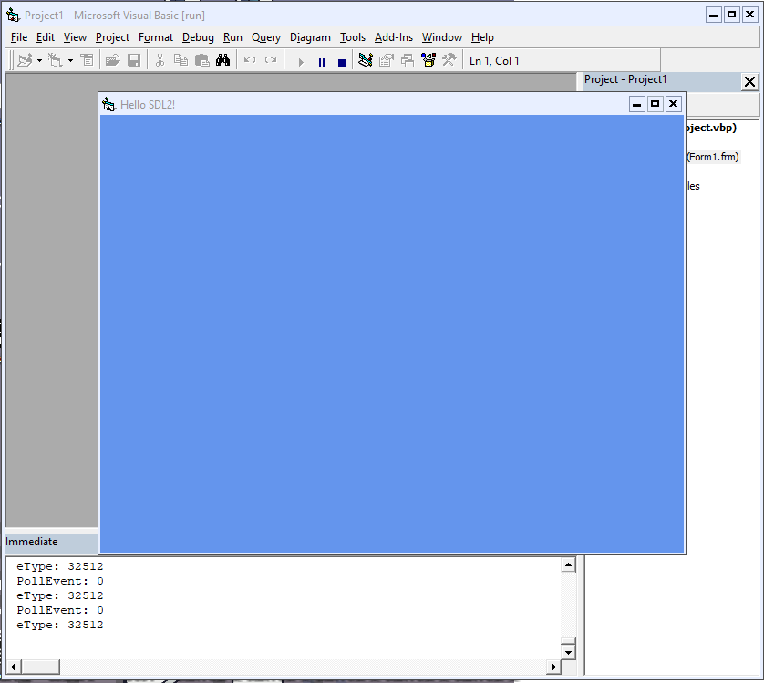

An attempt to use VB6 with SDL2

So far it has both the SDL window and the renderer set up

## Credits

Using XSDL2 wrapper by maxmex: https://github.com/xmaxmex/XSDL2

The source code was shared on VBForums:

https://www.vbforums.com/showthread.php?886469-RESOLVED-VB6-Help-with-SDL2-Public-Type-SDL_Rect&p=5476029&viewfull=1#post5476029

Shorter example (VBForums):

https://www.vbforums.com/showthread.php?803909-DLL-procedure-call-from-VB6&p=4976991&viewfull=1#post4976991
